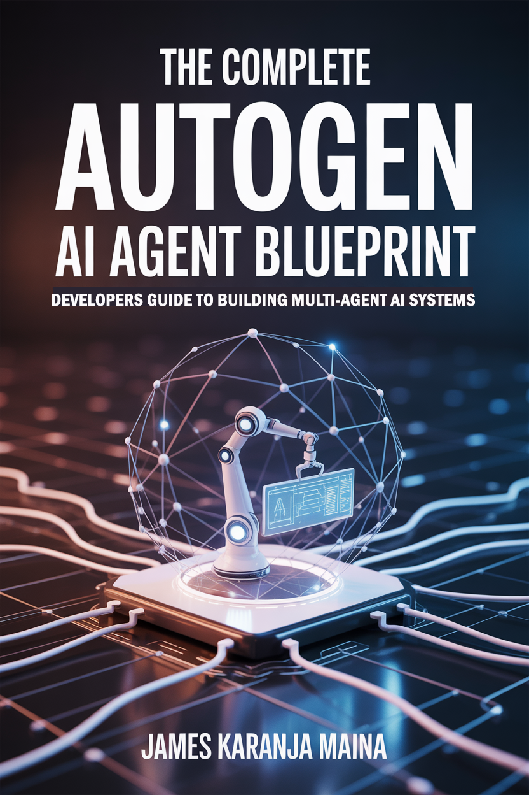
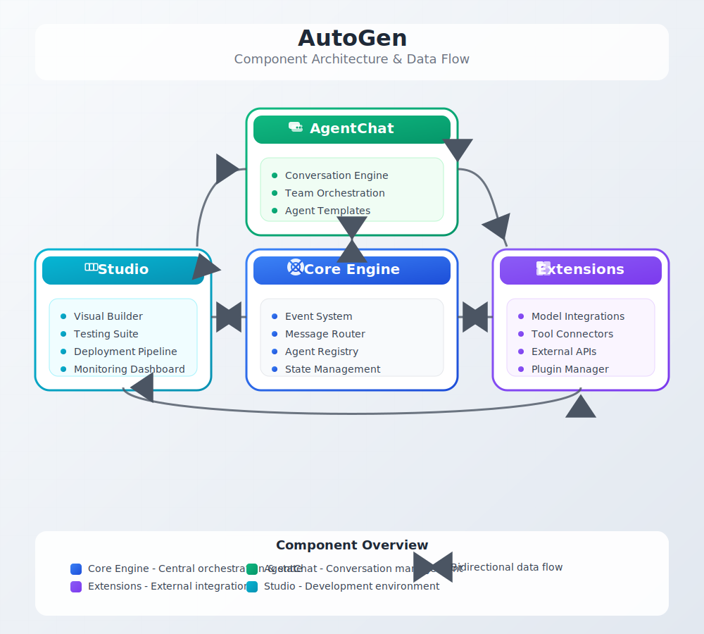

# The Complete AutoGen v0.6.1 Blueprint: Developer's Guide to Building Multi-Agent AI Systems

<div align="center">

[](https://www.amazon.com/Complete-AutoGen-Agent-Blueprint-Developers-ebook/dp/B0FFLJT82T)

**📚 [Available on Amazon](https://www.amazon.com/Complete-AutoGen-Agent-Blueprint-Developers-ebook/dp/B0FFLJT82T)**

*The definitive guide to building multi-agent AI systems using Microsoft's AutoGen framework version 0.5*

**Author:** James Karanja Maina

</div>

---

## 🚀 Overview

This repository contains the complete guide to building multi-agent AI systems using Microsoft's AutoGen framework version 0.6.1. The book covers the entire framework from basic concepts to advanced production deployments, with a focus on practical implementation and best practices.

## 🏗️ System Architecture

AutoGen v0.6.1 introduces a sophisticated, modular architecture designed for scalable multi-agent systems:

<div align="center">

### AutoGen Component Interaction


### Multi-Agent Orchestration Overview


</div>

## 📖 Book Structure

The book is organized into three main parts with additional dedicated chapters:

### 🎯 Part I: Foundations (Chapters 1-6)
- **Chapter 1**: Introduction to AutoGen - Core concepts and framework overview
- **Chapter 2**: Assistant Agents and MCP - Building conversational agents
- **Chapter 3**: Agent Types and Streaming - Understanding different agent patterns
- **Chapter 4**: AutoGen Core Framework - Event-driven architecture fundamentals
- **Chapter 5**: Code Execution and Tools - Dynamic programming and tool integration
- **Chapter 6**: Web Integration and Advanced Tools - External service integration

### ⚙️ Part II: Intermediate Development (Chapters 7-11)
- **Chapter 7**: Orchestration Patterns - Basic coordination strategies
- **Chapter 8**: Advanced Orchestration - Complex multi-agent workflows
- **Chapter 9**: Memory and Context Management - Persistent conversations and RAG
- **Chapter 10**: Graph Flows and Optimization - Advanced workflow patterns
- **Chapter 11**: Advanced Multi-Agent Systems - Sophisticated coordination patterns

### 🚀 Part III: Advanced & Production (Chapters 12-16)
- **Chapter 12**: Human-in-the-Loop Integration - Interactive workflows and feedback
- **Chapter 13**: Performance and Deployment - Optimization and production readiness
- **Chapter 14**: Enterprise Deployment - Scalable production systems
- **Chapter 15**: Testing and Evaluation - Quality assurance frameworks
- **Chapter 16**: Advanced AI Integration - Cutting-edge capabilities and future patterns

## 🆕 New in AutoGen v0.5

AutoGen v0.5 introduces a revolutionary modular architecture with four main components:

| Component | Description | Key Features |
|-----------|-------------|--------------|
| **🧠 AutoGen Core** | Event-driven framework for building scalable multi-agent systems | Async-first design, Event handling, Message routing |
| **💬 AgentChat** | High-level API for building conversational agents | Team orchestration, Conversation management, Built-in patterns |
| **🔌 Extensions** | Implementations that interface with external services | Model integrations, Tool connectors, External APIs |
| **🎨 AutoGen Studio** | Web-based UI for prototyping agents without writing code | Visual builder, Testing interface, Deployment tools |

## 💻 Code Examples

All code examples are meticulously organized in this directory by chapters, with each example including:

- ✅ Detailed comments and explanations
- 🔧 Practical, runnable implementations
- 📝 Step-by-step guidance
- 🎯 Real-world use cases

### 🚀 Quick Start

1. **Install Dependencies:**
   ```bash
   pip install -r requirements.txt
   ```

2. **Navigate to Examples:**
   ```bash
   cd chapter1/
   ```

3. **Run Your First Agent:**
   ```bash
   python 01_basic_agent.py
   ```

## 🛠️ Requirements

- **Python 3.10+**
- **AutoGen v0.5+ packages:**
  - `autogen-core` - Core event-driven framework
  - `autogen-agentchat` - High-level conversational API
  - `autogen-ext` - Extensions and integrations
  - `autogenstudio` (optional) - Visual development environment

## ✨ Key Features Covered

### 🔄 **Async-First Design**
Working with async/await patterns throughout the framework for optimal performance.

### 📡 **Event-Driven Architecture** 
Understanding the Core event-driven programming model for scalable systems.

### 🎭 **Advanced Team Types**
- **RoundRobinGroupChat** - Sequential agent collaboration
- **SelectorGroupChat** - Intelligent agent selection
- **Swarm** - Dynamic agent coordination
- **GraphFlow** - Directed workflow orchestration

### 🤖 **Model Integration**
Working with various model providers through Extensions for maximum flexibility.

### 🎨 **AutoGen Studio**
Prototyping agents with the intuitive visual interface.

### 🌐 **Multimodal Capabilities**
Working seamlessly with text, images, audio, and other modalities.

### ⚡ **Distributed Agents**
Implementing scalable, distributed agent systems for enterprise needs.

## 🏗️ Project Structure

```
autogen_blueprint/
├── chapter1/          # Basic agents and concepts
├── chapter2/          # Assistant agents and MCP
├── chapter3/          # Agent types and streaming
├── chapter4/          # Core framework concepts
├── chapter5/          # Code execution and tools
├── chapter6/          # Web integration and tools
├── chapter7/          # Orchestration patterns
├── chapter8/          # Advanced orchestration
├── chapter9/          # Memory and context
├── chapter10/         # Graph flows and optimization
├── chapter11/         # Advanced multi-agent systems
├── chapter12/         # Human-in-the-loop patterns
├── chapter13/         # Performance and deployment
├── chapter14/         # Enterprise deployment
├── chapter15/         # Testing frameworks
├── chapter16/         # Advanced AI integration
└── utils/            # Shared utilities and configurations
```

## 🎯 Learning Path

### 🌱 **Beginner (Chapters 1-6) - Build Your Foundation**
Start here if you're new to AutoGen or multi-agent systems. Learn the fundamentals and build your first agents.

#### 🚀 **Complete Walkthrough: Your First AutoGen Agent**

Let's create a simple conversational agent step by step:

**1. Set up your environment:**
```bash
cd autogen_blueprint/chapter1/
export OPENAI_API_KEY="your_api_key_here"  # Replace with your actual API key
```

**2. Run the basic agent example:**
```bash
python 01_basic_agent.py
```

**3. Here's what the code does (`01_basic_agent.py`):**
```python
import asyncio
from autogen_agentchat.agents import AssistantAgent
from autogen_agentchat.ui import Console
from autogen_agentchat.conditions import MaxMessageTermination

async def main():
    # Create a helpful assistant agent
    agent = AssistantAgent(
        name="helpful_assistant",
        model_client=OpenAIChatCompletionClient(model="gpt-4o-mini"),
        system_message="You are a helpful AI assistant. Be concise and friendly."
    )
    
    # Start a conversation
    result = await Console(
        chat_completion_client=agent.model_client
    ).run_stream(
        task="Hello! Can you help me understand what AutoGen is?",
        termination_condition=MaxMessageTermination(max_messages=4)
    )

if __name__ == "__main__":
    asyncio.run(main())
```

**4. Expected Output:**
```
🤖 helpful_assistant: Hello! I'd be happy to help you understand AutoGen!

AutoGen is Microsoft's framework for building multi-agent AI systems. Here are the key points:

✨ **What it does:**
- Enables multiple AI agents to collaborate and communicate
- Supports complex workflows with agent coordination
- Provides both high-level and low-level APIs

🏗️ **Key Components:**
- **AgentChat**: Easy-to-use conversational agents
- **Core**: Event-driven architecture for scalability  
- **Extensions**: Integrations with external services
- **Studio**: Visual interface for building agents

🎯 **Perfect for:**
- Automated workflows, customer service, research tasks, and more!

Would you like me to explain any specific aspect in more detail?

Conversation completed! ✅
```

**📝 Try These Examples:**
1. **`chapter1/01_basic_agent.py`** - Create your first AutoGen agent with simple conversation capabilities
2. **`chapter2/01_assistant_agent.py`** - Build an assistant agent that can help with tasks and questions
3. **`chapter3/03_tool_assistant_agent.py`** - Add tool capabilities to make your agent interact with external services

```bash
# Quick start sequence:
cd chapter1 && python 01_basic_agent.py
cd ../chapter2 && python 01_assistant_agent.py  
cd ../chapter3 && python 03_tool_assistant_agent.py
```

### 🌿 **Intermediate (Chapters 7-11) - Master Orchestration**
Advance to complex orchestration patterns, memory management, and sophisticated multi-agent workflows.

**🔧 Build These Systems:**
1. **`chapter7/06_basic_round_robin.py`** - Implement round-robin agent coordination for sequential task processing
2. **`chapter9/06_personal_assistant.py`** - Create a memory-enabled personal assistant with context retention
3. **`chapter11/05_sequential_workflow.py`** - Build sophisticated multi-agent workflows with handoffs and collaboration

```bash
# Intermediate progression:
cd chapter7 && python 06_basic_round_robin.py
cd ../chapter9 && python 06_personal_assistant.py
cd ../chapter11 && python 05_sequential_workflow.py
```

### 🌳 **Advanced (Chapters 12-16) - Production Excellence**
Master enterprise deployment, testing frameworks, performance optimization, and cutting-edge AI integration.

**🚀 Deploy Production Systems:**
1. **`chapter13/05_workflow_optimization.py`** - Implement performance optimization and caching strategies for production
2. **`chapter14/02_kubernetes_deployment.py`** - Deploy scalable multi-agent systems on Kubernetes infrastructure
3. **`chapter16/02_multi_modal_orchestration.py`** - Build advanced multimodal agents with vision, audio, and text capabilities

```bash
# Advanced production examples:
cd chapter13 && python 05_workflow_optimization.py
cd ../chapter14 && python 02_kubernetes_deployment.py
cd ../chapter16 && python 02_multi_modal_orchestration.py
```

## 🤝 Contributing

This codebase follows the book's progression and maintains high code quality standards:

- All examples are tested and verified
- Code follows Python best practices
- Each chapter builds upon previous concepts
- Real-world applicability is prioritized

## 📚 Additional Resources

- **📖 [Full Book on Amazon](https://www.amazon.com/Complete-AutoGen-Agent-Blueprint-Developers-ebook/dp/B0FFLJT82T)**
- **🔗 [AutoGen Official Documentation](https://microsoft.github.io/autogen/)**
- **💻 [AutoGen GitHub Repository](https://github.com/microsoft/autogen)**
- **🎨 [Zavora Technologies](https://www.zavora.ai/)**

## 📄 License

This project is licensed under the MIT License - see the LICENSE file for details.

---

<div align="center">

**🚀 Ready to build the future of AI? Start with Chapter 1!**

[Get the Book](https://www.amazon.com/Complete-AutoGen-Agent-Blueprint-Developers-ebook/dp/B0FFLJT82T) • [Follow the Author](https://www.amazon.com/stores/James-Karanja-Maina/author/B0DPL8G1JH) 

</div>